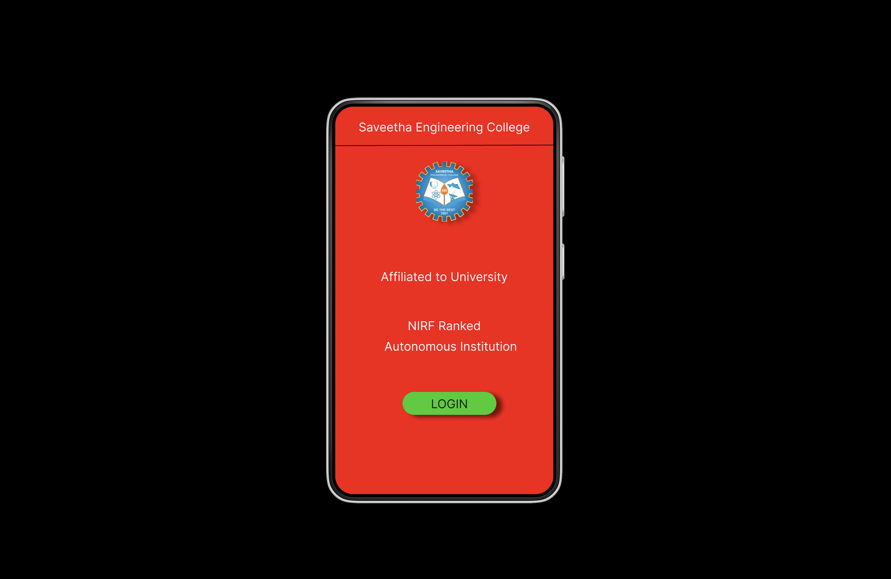
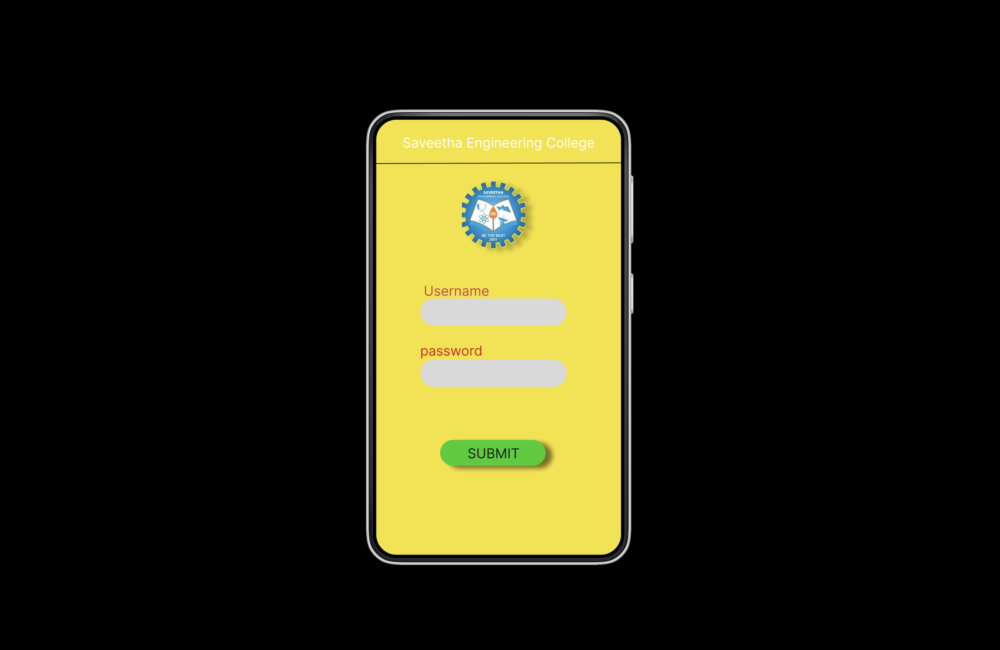
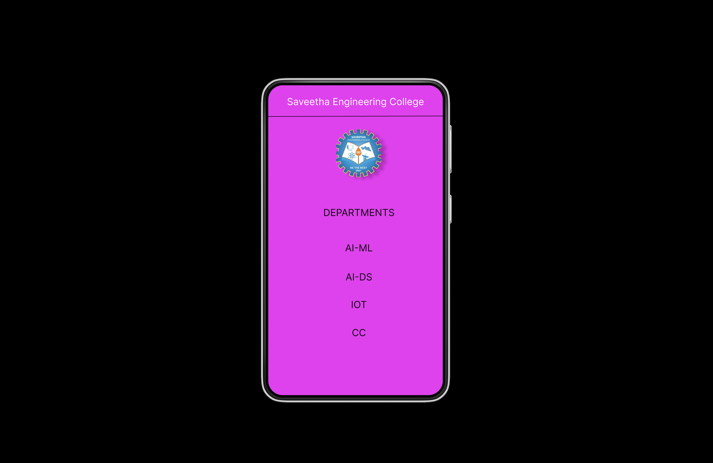

# Event Registration Web Application

## AIM:
To design, develop and deploy a web application for event registration.

## DESIGN STEPS:

### Step 1:
Create a new frame.

### Step 2:
Select any one preset size of your choice.

### Step 3:
Select the shapes you need.

### Step 4:
Import images as needed.

### Step 5:
Create pages based on your need and link them.

### Step 6:

Validate the HTML and CSS code.

### Step 6:

Publish the website in the given URL.

## DESIGN TOOL:
Figma

## code:
```
/* Home Page */
position: relative;
width: 360px;
height: 640px;
background: #FB0707;

/* login page */
position: relative;
width: 360px;
height: 640px;
background: #F5E12D;

/* Saveetha Engineering College */
position: absolute;
width: 324px;
height: 36px;
left: calc(50% - 324px/2);
top: 28px;
font-family: 'Inter';
font-style: normal;
font-weight: 400;
font-size: 20px;
line-height: 24px;
display: flex;
align-items: center;
text-align: center;
color: #FFFFFF;

/* image 1 */
position: absolute;
width: 92.94px;
height: 100px;
left: calc(50% - 92.94px/2 + 6.47px);
top: 90px;
background: url(image.png);
filter: drop-shadow(10px 4px 8px rgba(0, 0, 0, 0.25));

/* Line 1 */
position: absolute;
width: 360px;
height: 0px;
left: 0px;
top: 65px;
border: 1px solid #000000;
transform: rotate(-0.16deg);

/* DEPARTMENTS */
position: absolute;
width: 178px;
height: 32px;
left: 98px;
top: 247px;
font-family: 'Inter';
font-style: normal;
font-weight: 400;
font-size: 20px;
line-height: 24px;
display: flex;
align-items: center;
text-align: center;
color: #0E0D0D;

/* AI-ML */
position: absolute;
width: 178px;
height: 32px;
left: 98px;
top: 320px;
font-family: 'Inter';
font-style: normal;
font-weight: 400;
font-size: 20px;
line-height: 24px;
display: flex;
align-items: center;
text-align: center;
color: #0E0D0D;

/* AI-DS */
position: absolute;
width: 178px;
height: 32px;
left: 98px;
top: 380px;
font-family: 'Inter';
font-style: normal;
font-weight: 400;
font-size: 20px;
line-height: 24px;
display: flex;
align-items: center;
text-align: center;
color: #0E0D0D;

/* IOT */
position: absolute;
width: 178px;
height: 32px;
left: 98px;
top: 437px;
font-family: 'Inter';
font-style: normal;
font-weight: 400;
font-size: 20px;
line-height: 24px;
display: flex;
align-items: center;
text-align: center;
color: #0E0D0D;

/* CC */
position: absolute;
width: 178px;
height: 32px;
left: 98px;
top: 495px;
font-family: 'Inter';
font-style: normal;
font-weight: 400;
font-size: 20px;
line-height: 24px;
display: flex;
align-items: center;
text-align: center;
color: #0E0D0D;
```

## OUTPUT:




## RESULT:
The program to design, develop and deploy a web application for event registration is completed successfully.